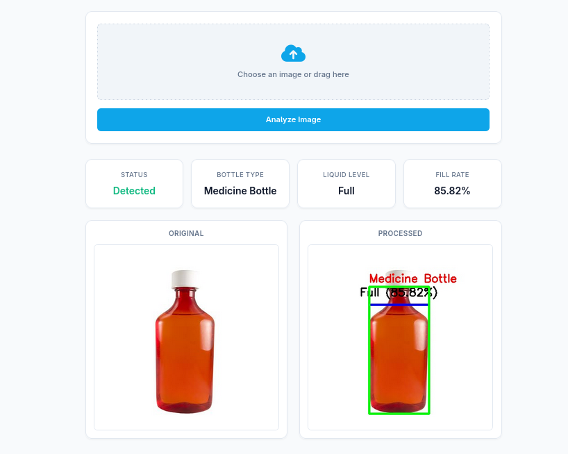

# Overview
This is my computer vision project, where I use several computer vision techniques to detect a medical bottle. In the future, I will implement a more accurate process or add a model.

### Limitations

This system relies on traditional *Computer Vision* techniques such as pixel-level processing, which come with certain limitations:
* Optimal accuracy is achieved on images with plain backgrounds and high contrast.
* The detection may fail if the bottle is held by a hand or partially obscured by other objects.
* The analysis is highly sensitive to lighting quality and strong glare/reflections on glass or plastic surfaces.

### Features
* **Bottle Detection:** Finds and draws a green bounding box around the largest medical bottle detected in the image.
* **Type Classification:** Identifies whether the bottle is a *Medicine Bottle*, *Blood Transfusion Bottle*, or other type.
* **Liquid Level Analysis:** Draws a blue level line and dynamically calculates the liquid volume percentage, adapting to different lighting conditions.
* **Status Classification:** Categorizes the bottle's fill status as *Full*, *Half*, or *Empty*.

## Example Usage

##  Prerequisites

Before running the project, make sure you have the following installed:
* Python 3.8 or newer.
* Pip (Python Package Installer).

##  Installation

**Install Dependencies:**

    
    pip install -r requirements.txt
    
